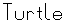
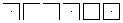

# Turtlefont

Turtlefont is a small vector graphics font file format with an example font. It uses simple [turtle graphics](https://en.wikipedia.org/wiki/Turtle_graphics) rendering which allows flexible scaling.

## Features

> _TO BE DONE_

## Fonts

This project also provides some font specimen examples:

-  [Turtle](fonts/default.tfn)
-  [Pigpen](fonts/pigpen.tfn) (more info can be found [here](https://en.wikipedia.org/wiki/Pigpen_cipher))

## Binary Format

**Mime type:** `application/x-turtle-font`

> _TO BE DONE_

## Human Readable Font Definition Format

**Mime type:** `text/x-turtle-font`

The demo features an example font format which allows the definition of multiple glyphs.

The format is line based and does not allow any other lines except for lines in the following format:

    C:CODE\n

`C` is the character for which a glyph should be defined.

`CODE` is a glyph definition in the format specified in _Glyph Format_.

`\n` is a newline character.

## Glyph Format

Turtlefont has a simple glyph description language which contains commands with or without parameters. A command is a single character,
a parameter as well.

Parameters can only be numeric with a pretty restricted format: It is only a single hexadecimal character in the range of `0` to `F`. If a negative number is needed, the character can be prefixed with a `-`.

Whitespace is ignored.

### Commands

| Command | Parameters | Name        | Description                         |
| ------- | ---------- | ----------- | ----------------------------------- |
| a       | n          | Advance     | Sets the glyph width to n elements. |
| M       | x y        | Move (abs)  | Moves the cursor without drawing.   |
| m       | x y        | Move (rel)  | Moves the cursor without drawing.   |
| P       | x y        | Print (abs) | Draws a line and moves the cursor.  |
| p       | x y        | Print (rel) | Draws a line and moves the cursor.  |
| d       |            | Dot         | Draws a dot at the cursor position. |
